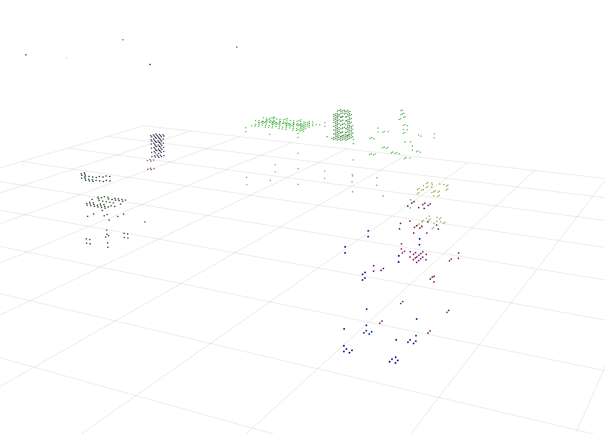
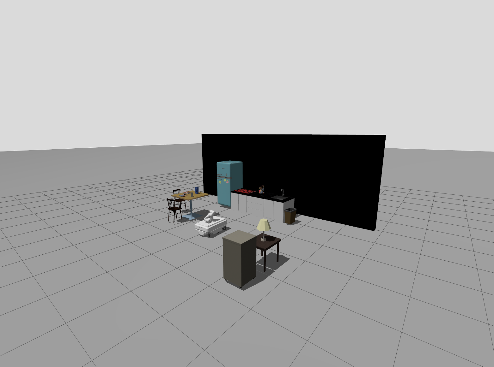
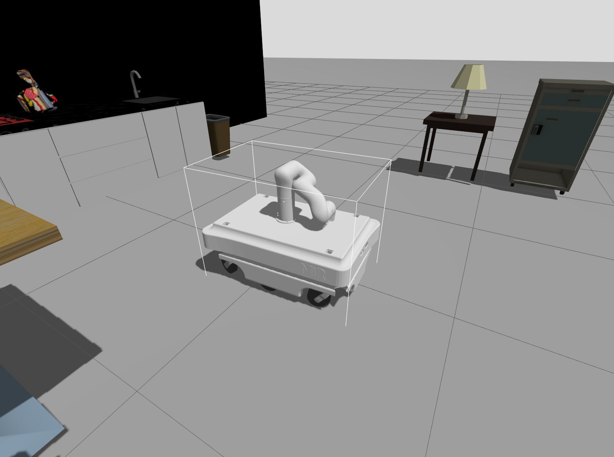

# kitchen_bot
Assignment for nolon.ai

## ToDo List

### Gazebo Simulation Setup
- [x] Load a kitchen model in Gazebo
- [x] Setup AMR Cad Urdf with controller
- [ ] Setup Robotic Arm Urdf with controller
- [ ] Add camera to the robot (Last Checkpoint)

### Semantic Segmentation
- [x] Extract Semantic Information from the kitchen model
- [x] Write the code to generate 3D Voxel map
- [x] Incorporate the semantic information into the Voxel Map

### RGBD Perception
- [ ] Get image RGBD images from the camera
- [ ] Write the code to perform semantic segmentation 

### Path Planning
- [ ] Learn and look into the moveit package
- [ ] Perform Path planning on the 6 DOF Arm
- [ ] Perform Path Planning on the AMR
- [ ] Perform Joint path planning for both Arm and AMR
- [ ] Simulate the cleaning action
- [ ] Incorporate semantic segmentation

## How to Run
1. Install the required dependencies
```shell script
sudo apt install libeigen3-dev libpcl-dev libassimp-dev
```

2. First create a ros2 workspace to run the packages in

```shell script
mkdir -p kitchen_ws/src
cd kitchen_ws/src
git clone https://github.com/aayush-rath/kitchen_bot.git
```

3. Build the packages using colcon (Make sure you have ros2 installed)
```shell script
cd <path-to-kitchen_ws>
colcon build && source install/setup.bash
```

4. Run the package and generate the 3D voxel grid map
```shell script
ros2 launch kitchen_bot_description view_urdf.launch.py
```

5. In another terminal run the following command
```shell script
ros2 run semantic_voxel_mapper semantic_voxel_mapper_node
ros2 run rviz2 rviz2
```

5. You can view the 3D Voxel map in rviz by selecting the marker array topic

## Images
<figure align="center">
    
    <figcaption align="center">3D Voxel Semantic Map</figcaption>
</figure>

<figure align="center">
    
    <figcaption  align="center">Kitchen Simulation Environment</figcaption>
</figure>

<figure align="center">
    
    <figcaption  align="center">Robot Arm on AMR</figcaption>
</figure>

## Reflections

1. Most of the time went into setting up the simulation environment and resolving errors which is expected while working with ROS2 and gz
2. Could have made the path planning module if I would have had more time along with an improved voxel grid implementation (looks very sparse now) and also incorporated semantic segmentation on rgbd camera images
3. If all the modules would have been finished in the given time then I would have moved on to joint optimization of the path planning part

## Attributions
The kitchen_bot has been are derived from [mir_robot](https://github.com/DFKI-NI/mir_robot.git) by [Martin Günther](https://github.com/mintar) and the kitchen-arm has been derived from [xarm_ros2](https://github.com/xArm-Developer/xarm_ros2.git) by [Dwen](https://github.com/vimior), used under the BSD-3 Clause.
